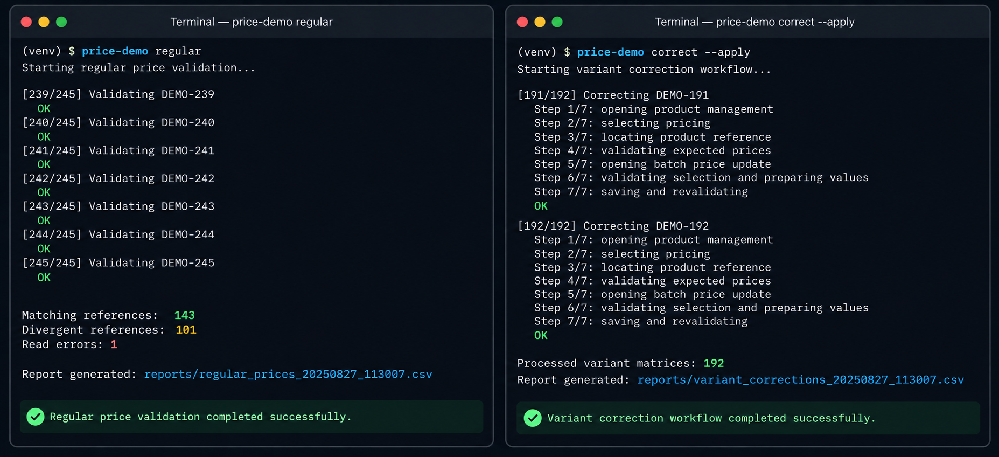

# E-commerce Price Validation & Correction Automation

A public reconstruction of an automation built around a real e-commerce pricing workflow.

The difficult part was not simply reading prices from a browser. The workflow had to decide when a divergence was actually actionable across **color × size variants**, variant-level stock availability and partially completed executions — while avoiding unsafe or repeated writes.

This repository recreates those engineering problems with synthetic data and a local demo environment.

<p>
  
  
  
</p>

---

## Context

The original workflow was used to validate pricing information in an e-commerce operation.

| Workflow | Observed scale |
|---|---:|
| Regular price validation | **245 product references** |
| Pricing inconsistencies identified | **101 references** |
| Variant matrix validation | **244 references** |
| Variant correction workflow | **192 matrices** |
| Divergence × stock analysis | **20 divergences** |

These figures come from separate execution snapshots and are included only to show the scale of the original problem. They are not demo results or success-rate claims.

> [!NOTE]
> This is a sanitized public reconstruction. It does not contain production source code, company data, credentials, private endpoints, original selectors or proprietary business rules.

---

## What made this tricky

### Variant-level validation

A product reference can contain multiple **color × size** combinations.

Each variant needs to be evaluated independently so that a valid value in one cell cannot hide a divergence in another.

The workflow preserves expected and observed values separately to keep the validation auditable.

### Stock-aware decisions

A pricing divergence is not automatically actionable.

The automation cross-checks each divergent variant against its corresponding stock state and keeps active divergences, no-stock cases and read failures as different states.

Stock from one variation must never validate another.

### Safe corrections

Corrections are limited to explicitly approved references.

Before writing, the automation validates the expected target. The correction intent is persisted before the save operation, and the resulting state is reloaded and verified afterwards.

When the observed state matches neither the previous state nor the intended target, the workflow stops instead of retrying blindly.

### Recovery and idempotency

Long-running browser automation can be interrupted.

The project persists enough execution state to reconcile interrupted operations, confirm writes that already happened and resume without repeating or conflicting with previous saves.

---

## Architecture

```text
Synthetic Data
      │
      ▼
Local Demo Interface
      │
      ▼
Selenium Automation
      │
      ├── Price Validation
      ├── Variant Validation
      ├── Stock Cross-check
      └── Safe Correction
                │
                ▼
        Revalidation & Audit
                │
        ┌───────┴───────┐
        ▼               ▼
    CSV Reports     SQLite Journal
```

Browser automation, domain rules, validation, correction workflows and reporting are kept separate.

```text
src/price_demo/
├── browser/
├── checkers/
├── correctors/
├── domain/
├── reports/
└── cli.py

fixtures/
tests/
```

---

## Running locally

### Requirements

- Python **3.11+**
- Google Chrome
- Git, if cloning the repository

### Setup

```bash
python -m venv .venv
python -m pip install -e ".[test]"
```

Run the complete demo:

```bash
price-demo all
```

Or execute individual workflows:

```bash
price-demo regular
price-demo xg
price-demo stock
price-demo correct
```

To enable approved write operations inside the local synthetic demo:

```bash
price-demo correct --apply
```

> [!WARNING]
> `--apply` only enables writes inside the synthetic local environment.
>
> Production URLs and real credentials are not accepted by the project.

---

## Execution preview

<p align="center">
  
</p>

The preview represents the reconstructed workflows using synthetic or anonymized references, paths, interface elements and execution data.

---

## Tests

The test suite covers business rules, browser behavior, recovery and correction safety.

```bash
python -m pytest -q
python -m pytest -m "not browser" -q
python -m pytest -m browser -q
```

Current validation:

- **97 tests passing**
- **82 unit tests**
- **15 integration tests using real Google Chrome**
- validation across **245 synthetic product references**
- resume and recovery scenarios
- idempotency checks

The browser tests run against the bundled local HTML fixture rather than an external production system.

---

## Public reconstruction

The repository intentionally preserves the engineering problems rather than the original operational environment.

It contains no:

- production source code
- real company data
- real product references
- credentials
- private API endpoints
- original selectors
- internal screenshots
- proprietary business rules

All public assets and scenarios were recreated for demonstration purposes.

---

## Documentation

- [Validation](docs/validation.md)
- [Design decisions](docs/design.md)
- [Security](docs/security.md)

---

## License

Licensed under the [MIT License](LICENSE).
