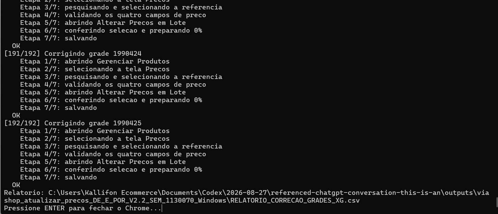
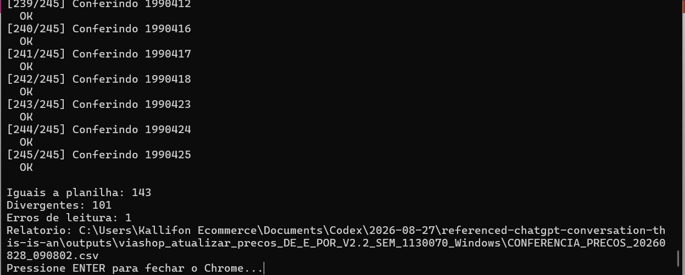

<div align="center">

# E-commerce Price Validation & Correction Automation

**Python + Selenium automation for price validation, product variant analysis, stock-aware divergence detection, and safe selective correction.**

<p>
  
  
  
  
</p>

</div>

---

## 🚀 Overview

This project reconstructs a real-world e-commerce automation workflow designed to validate pricing data, analyze product variants, detect stock-aware divergences, and apply safe selective corrections.

### What it does

- validates expected vs. displayed prices
- analyzes **color × size** product variants
- cross-checks pricing divergences with stock availability
- applies corrections only when safety conditions are satisfied
- revalidates saved values after updates
- supports safe interruption and resumption
- generates auditable reports

> [!IMPORTANT]
> **This repository does not contain production code.**
>
> Product data, interface elements, selectors, scenarios, and demo assets were created from scratch for portfolio purposes.

---

## 📊 Real-World Context

The project is based on a real operational workflow used in e-commerce pricing validation.

| Workflow | Observed scale |
|---|---:|
| Regular price validation | **245 product references** |
| Pricing inconsistencies identified | **101 references** |
| Variant matrix validation | **244 references** |
| Variant correction workflow | **192 matrices** |
| Divergence × stock analysis | **20 divergences** |

> [!NOTE]
> These figures come from separate real-world execution snapshots and are presented only as context. They are not demo results or success-rate claims.

---

## ✨ Key Features

### 🔎 Price Validation

- Compares expected and displayed prices
- Preserves observed and expected values for auditability
- Detects missing, unreadable, or incomplete fields

### 🎨 Variant Matrix Analysis

- Reads **color × size** combinations
- Validates wholesale and retail values independently
- Identifies divergent cells individually

### 📦 Stock-Aware Validation

- Cross-checks only divergent variants against stock
- Prevents stock from one variant from validating another
- Separates active divergences, no-stock cases, and read errors

### 🛡️ Safe Correction

- Processes only explicitly approved references
- Validates targets before write operations
- Reopens and verifies values after saving
- Stops on uncertain state instead of retrying blindly

### 🔁 Resume & Idempotency

- Persists correction intent
- Reconciles interrupted operations
- Prevents repeated or conflicting writes

---

## 🏗️ Architecture

```text
Synthetic Data
      │
      ▼
Local Demo Interface
      │
      ▼
Selenium Automation
      │
      ├── Price Validation
      ├── Variant Validation
      ├── Stock Cross-check
      └── Safe Correction
                │
                ▼
        Revalidation & Audit
                │
        ┌───────┴───────┐
        ▼               ▼
    CSV Reports     SQLite Journal
```

The codebase separates browser automation, domain rules, validation logic, correction workflows, reporting, and synthetic fixtures.

```text
src/price_demo/
├── browser/
├── checkers/
├── correctors/
├── domain/
├── reports/
└── cli.py

fixtures/
tests/
```

---

## ▶️ Running Locally

### Requirements

- Python **3.11+**
- Google Chrome
- Git

### Setup

```bash
python -m venv .venv
python -m pip install -e ".[test]"
```

### Run the full demo

```bash
price-demo all
```

### Run individual workflows

```bash
price-demo regular
price-demo xg
price-demo stock
price-demo correct
```

### Apply approved demo corrections

```bash
price-demo correct --apply
```

> [!WARNING]
> `--apply` only enables write operations inside the **local synthetic demo**.
>
> The project does not accept production URLs or real credentials.

---

## 🖥️ Execution Preview

Below are example terminal screenshots from the reconstructed workflow.

### Regular Price Validation

<p align="center">
  
</p>

This execution shows the validation of **245 product references**, including:

- **143 matching references**
- **101 divergent references**
- **1 read error**

The workflow compares observed values against expected pricing data and generates an auditable report at the end of the execution.

### Variant Correction Workflow

<p align="center">
  
</p>

This execution shows the correction flow applied to product variant matrices.

Each correction follows a structured **7-step validation and update process**:

1. open product management
2. select pricing
3. locate and select the product reference
4. validate the expected price fields
5. open batch price update
6. verify the selected target and prepare values
7. save and confirm the correction

The observed workflow processed up to **192 variant matrices** in a single execution.

> [!NOTE]
> The screenshots are provided as operational context.
>
> The public repository contains a sanitized reconstruction and does not expose production source code, private interfaces, credentials, or proprietary data.

---

## 🧪 Testing

The project includes automated validation for business rules, browser behavior, recovery, and correction safety.

```bash
python -m pytest -q
python -m pytest -m "not browser" -q
python -m pytest -m browser -q
```

### Current status

- **97 tests passing**
- **82 unit tests**
- **15 browser tests using real Google Chrome**
- Validation across all **245 synthetic product references**
- Resume and recovery scenarios
- Idempotency checks

---

## 🔒 Security & Sanitization

The public repository does **not** include:

- production source code
- real company data
- real product references
- credentials
- private API endpoints
- original selectors
- internal screenshots
- proprietary business rules

All public demo assets and scenarios were recreated from scratch.

The repository preserves only the **engineering concepts, workflow structure, safety mechanisms, and architectural decisions**.

---

## 📚 Documentation

More detailed technical information is available in:

- [🧪 Validation](docs/validation.md)
- [🧠 Design Decisions](docs/design.md)
- [🔒 Security](docs/security.md)

---

## 📄 License

This project is licensed under the **MIT License**.
