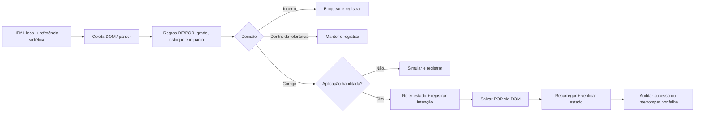

# Ecommerce Price Validation · Python + Selenium

**Demonstração pública sanitizada, reconstruída do zero com dados sintéticos e HTML local.** Este projeto ilustra conceitos de validação e correção seletiva de preços em e-commerce. Não é o código usado em produção, não reproduz sua estrutura e não acessa uma loja real.

## Problema

Uma alteração de integração pode modificar o preço promocional **POR**, enquanto o preço **DE** permanece correto. Corrigir indiscriminadamente pode sobrescrever alterações legítimas ou afetar itens sem estoque. A demonstração compara uma referência sintética com o DOM, avalia as condições de correção e verifica o resultado salvo.

## Contexto real — separado dos resultados do demo

Segundo o relato do autor, uma automação em **Python/Selenium** foi utilizada durante uma campanha promocional para analisar **245 produtos** e corrigir **101 referências** impactadas por alterações da API. Também houve análise de **193 referências com grades XG**.

Esses números descrevem o escopo do trabalho real informado pelo autor. Não são resultados deste repositório, benchmarks nem evidência de validação desta implementação em produção. Produtos e referências não são tratados como unidades equivalentes para calcular taxas. Nenhum ROI, implantação ou ganho financeiro é alegado.

## Arquitetura

```text
src/price_demo/
  models.py       tipos imutáveis e parser estrito
  collector.py    coleta e interação Selenium com o DOM local
  rules.py        decisões puras, sem navegador
  executor.py     rechecagem, correção e validação pós-escrita
  report.py       auditoria JSONL e trava de execução
  cli.py          execução em simulação ou aplicação local
fixtures/
  baseline.json   referência de campanha exclusivamente sintética
  catalog.html    catálogo editável local e persistência por sessão
tests/            regras, falhas, retomada e integração com Chrome real
docs/             decisões, segurança e evidência de validação
.github/workflows/tests.yml
```



## Destaques técnicos

- Varejo e atacado são ofertas independentes do mesmo produto sintético.
- `Decimal` e parsing estrito: valores como `100.00`, sem arredondamento silencioso de entradas inválidas.
- Diferença absoluta de até **R$ 0,01**, inclusive, não gera reparo. Mudança relevante de DE bloqueia correção automática.
- Somente a origem controlada `synthetic_api_drift` permite corrigir POR. É uma etiqueta do mock; a diferença de preço, sozinha, não prova alteração por API.
- Validação exata das combinações cor/tamanho, duplicatas, presença de XG, estoque inteiro não negativo e XG vendável.
- Antes de corrigir: exposição estimada sobre estoque, limite de variação de 25% do POR esperado e margem bruta mínima de 10%. **Os dois limites são escolhas didáticas, não regras reveladas da operação real.**
- Releitura antes da escrita; `clear`, `send_keys` e `click` em elementos Selenium, sem PyAutoGUI ou coordenadas. Espera explícita pelo preço salvo.
- Pós-escrita exige recarregar a página e conferir preço, DE, origem e grade/estoque.
- Simulação por padrão; falha de coleta, auditoria ou confirmação interrompe o lote, sem repetição cega ou rollback automático.
- Auditoria JSONL registra horário UTC, execução, identidade sintética, estado anterior, decisão, alvo, delta unitário, exposição e resultado.

## Exemplo antes/depois — exclusivamente sintético

| Oferta | DE | POR coletado | POR esperado | Resultado em aplicação |
|---|---:|---:|---:|---|
| SYN-001 · varejo | R$ 120,00 | R$ 110,00 | R$ 100,00 | Corrige para R$ 100,00 |
| SYN-001 · atacado | R$ 90,00 | R$ 85,00 | R$ 80,00 | Corrige para R$ 80,00 |
| SYN-002 · varejo | R$ 120,00 | R$ 100,01 | R$ 100,00 | Mantém pela tolerância |
| SYN-003 · varejo | R$ 120,00 | R$ 110,00 | R$ 100,00 | Bloqueia: sem estoque |
| SYN-004 · atacado | R$ 90,00 | R$ 85,00 | R$ 80,00 | Bloqueia: grade incompleta |
| SYN-005 · varejo | R$ 120,00 | R$ 110,00 | R$ 100,00 | Bloqueia: causa desconhecida |

No varejo de SYN-001, delta unitário = 100 − 110 = **−R$ 10,00**; com seis unidades, exposição = **−R$ 60,00**. Isso expressa uma diferença nominal sobre estoque, não prejuízo, receita realizada ou previsão de vendas. Não some exposições de atacado e varejo: o estoque pode ser compartilhado.

## Como rodar localmente

Requisitos: Python 3.11 ou superior, Google Chrome e terminal na raiz do repositório. Dependências e Selenium Manager podem precisar de rede para instalação/download do driver. A aplicação navega somente no arquivo HTML incluído. Use instalação editável a partir do checkout; publicação como wheel independente não faz parte do escopo.

```bash
python -m venv .venv
# Windows PowerShell:
.venv\Scripts\Activate.ps1
# Linux/macOS: source .venv/bin/activate
python -m pip install -e ".[test]"

# Padrão: simulação, sem salvar preços
price-demo

# Aplica apenas no HTML local e reconcilia novamente na mesma sessão
price-demo --apply --repeat
```

Na primeira passagem aplicada, são esperadas **2 correções, 1 manutenção e 3 bloqueios**. Na segunda, **0 correções, 3 manutenções e 3 bloqueios**. São seis ofertas sintéticas; não representam as métricas da operação real.

O relatório é criado em `reports/audit.jsonl` e não entra no Git. Para inspecionar o catálogo manualmente, abra `fixtures/catalog.html` em um navegador.

## Retomada e persistência

O mock usa `sessionStorage`: os dados salvos sobrevivem ao recarregamento da página dentro da sessão. `--repeat` demonstra reconciliação sem novas escritas para preços já corrigidos. Uma nova execução abre um navegador temporário e reinicia o catálogo sintético; o histórico JSONL é mantido.

A lógica não pula itens com base em um sucesso antigo: sempre relê e reavalia o estado observado. Os testes com fake persistente cobrem interrupção depois de salvar e antes de confirmar. Persistência entre processos do navegador, transações em backend e recuperação de uma loja real não são demonstradas.

A trava `reports/run.lock` impede dois processos CLI no mesmo checkout. Depois de encerramento abrupto, inspecione o processo e o relatório antes de remover uma trava antiga. Não há coordenação distribuída entre cópias do projeto.

## Testes e CI

```bash
python -m pytest -q                  # todos, incluindo Chrome real
python -m pytest -m "not browser" -q # regras e integração com fakes
python -m pytest -m browser -q       # HTML local com Selenium real
```

A integração com navegador não é silenciosamente ignorada se Chrome/driver estiverem indisponíveis. O workflow GitHub Actions executa testes sem navegador em Python 3.11–3.14 e integração Selenium em Python 3.12. A evidência local e o estado da CI estão em [docs/validation.md](docs/validation.md).

## Segurança e limites

Nenhum código de produção foi consultado ou copiado. Todos os IDs, seletores, preços, cores e estruturas foram inventados para esta demonstração. Não há empresas, clientes, produtos reais, cookies, credenciais, endpoints de negócio ou URLs internas. O adapter não recebe URL externa nem perfil autenticado. O HTML bloqueia conexões de rede via CSP.

O demo não implementa integração com API, login, backend, concorrência transacional, tributação, frete, pedidos, credenciais ou implantação. A rechecagem reduz risco de estado desatualizado, mas não elimina a janela entre leitura e escrita. Para entender o escopo, consulte [docs/design.md](docs/design.md) e [docs/security.md](docs/security.md).

Referências técnicas: [Selenium WebDriver](https://www.selenium.dev/documentation/webdriver/), [Selenium Python e Selenium Manager](https://www.selenium.dev/selenium/docs/api/py/), [testes Python no GitHub Actions](https://docs.github.com/en/actions/tutorials/build-and-test-code/python).

## Licença

[MIT](LICENSE), aplicável exclusivamente a esta reconstrução pública.
